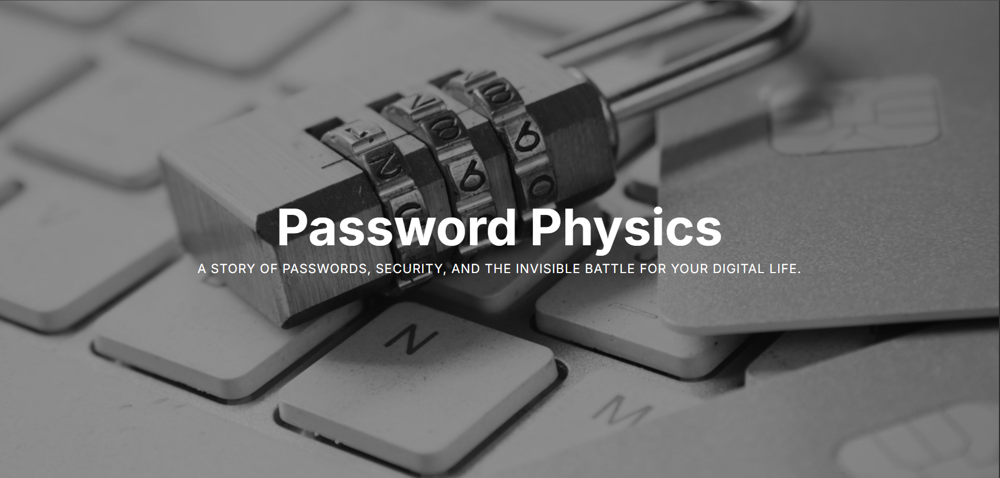

# Password Physics



Ever wondered if your password "password123" would survive a hacker's coffee break? This little web app will show you exactly how long it would take someone to crack your password, complete with some fancy visual effects and memes that roast your security choices.

## What is this?

It's a simple tool that analyzes your password in real-time as you type. It calculates password entropy (fancy math stuff), shows you crack time estimates for different attack scenarios, and gives you feedback on how to make your password less terrible. Plus, there are memes. Because why not?

## Try it out

You can check it out live here: [https://avanith12.github.io/password-visualizer/home.html](https://avanith12.github.io/password-visualizer/home.html)

Just type a password and watch the magic happen. Or the horror, depending on how bad your password is.

## What it shows you

- Password strength rating (from "please don't use this" to "okay you're safe")
- Entropy in bits (the math behind password strength)
- How long it would take to crack your password under different attacks (throttled online, GPU hashing, botnet attacks)
- Visual feedback with animations that change based on strength (cracked bars for weak passwords, glowing effects for strong ones)
- Character breakdown showing counts of uppercase, lowercase, numbers, and symbols
- Requirements checklist to see if your password meets common security standards
- Password suggestions with copy functionality to help you create stronger passwords
- Easter eggs that roast you if you use common weak passwords like "password123" or "qwerty"
- Memes that make fun of your password choices

## Pages

- `home.html` - **Entry point** - Story page with information about password security and the top 10 most common passwords
- `index.html` - Interactive password visualizer tool

## File Structure

```
password-visualizer/
├── home.html          # Story page (entry point)
├── index.html         # Interactive password visualizer
├── script.js          # JavaScript logic for password analysis
├── style.css          # Custom CSS animations and styles
├── image.png          # Project screenshot
├── README.md          # Project documentation
└── LICENSE            # MIT License
```

## Home Page Features

The home page includes:
- Hero image with title overlay
- Story about password security and why good passwords matter
- Top 10 most common passwords of 2025
- Information about password vulnerabilities and hacker tactics

## Credits

- The top 10 most common passwords list was sourced from [@themakeshiftproject](https://www.instagram.com/themakeshiftproject/) on Instagram from a reel they posted. This website was inspired by that reel.
- Hero image from [Unsplash](https://unsplash.com/)

## How to use it locally

1. Clone this repo or download the files
2. Open `home.html` in your browser (this is the entry point - start here!)
3. Navigate to the visualizer from the home page, or open `index.html` directly to go straight to the tool
4. Start typing passwords and feel bad about your security habits

That's it. No build process, no dependencies to install, just pure HTML, CSS, and JavaScript.

## Disclaimer

This is for educational purposes only. Please don't use this to judge other people's passwords or hack into things. Use it to learn about password security and maybe, just maybe, convince yourself to stop using "123456" as your password.

## Technologies

- HTML, CSS, JavaScript (the classics)
- Tailwind CSS for styling
- zxcvbn library for password strength estimation

## License

This project is licensed under the MIT License - see the [LICENSE](LICENSE) file for details.

That's pretty much it. Sometimes the simplest tools are the most fun to use.


